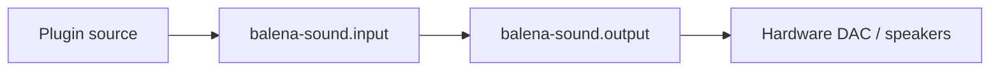
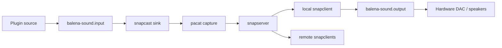
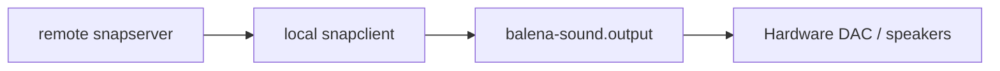
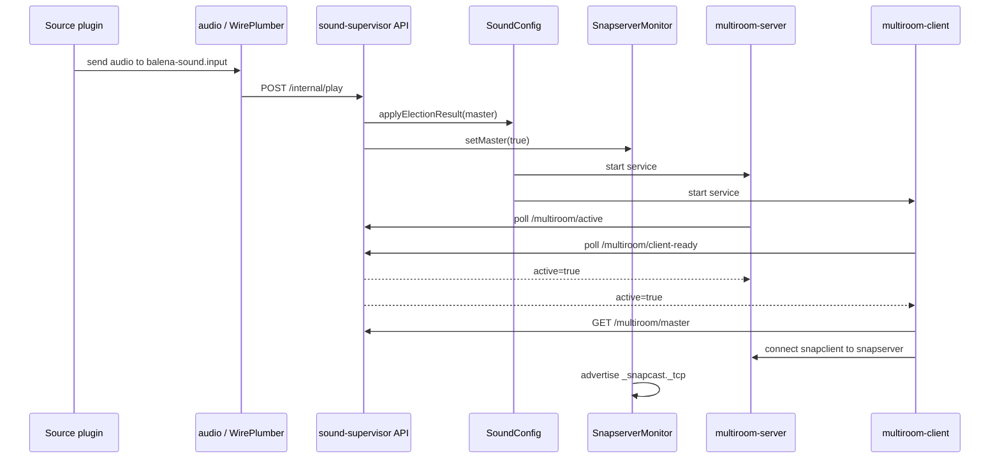
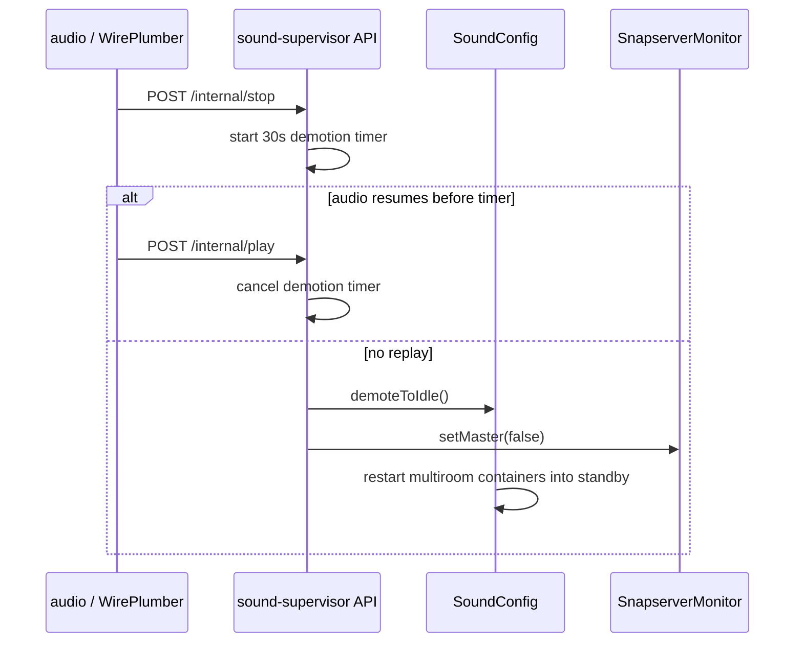
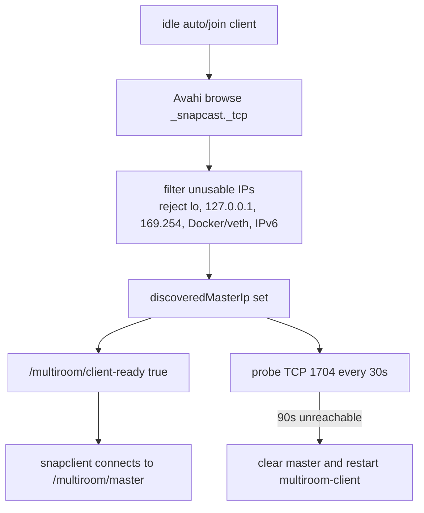

# Runtime States

`SOUND_MULTIROOM_ROLE` is configuration. Runtime state is what the device is doing right now.

## Role matrix

| Configured role | Source plugins | Runs `multiroom-server` | Runs `multiroom-client` | Can become master | Typical use |
|---|---|---:|---:|---:|---|
| `auto` | yes | pre-warmed, active after promotion | pre-warmed, active after target exists | yes, on first play | Normal devices. |
| `host` | yes | yes | yes | always | Dedicated source/master device. |
| `join` | no | no | yes | no | Passive speaker. |
| `disabled` | yes | no | no | no | Independent standalone room. |

## Runtime audio paths

### Disabled standalone

Owner notes:

- Configured by `core/audio/start.sh` when role is `disabled`.
- `sound-supervisor` stops both multiroom services and starts source plugins.

### Multiroom master with local playback

Owner notes:

- The master normally hears itself through its own local `snapclient`.
- `multiroom-server` waits for `/multiroom/active` before starting `pacat`.
- `multiroom-client` waits for `/multiroom/client-ready`, fetches `/multiroom/master`, and respawns if the master IP changes.

### Remote client playback

Owner notes:

- `join` devices live here all the time.
- `auto` devices live here when they discover another master before promoting.
- Source plugins should be stopped for `join`, but remain active for `auto`.

### Auto master direct fallback

Owner notes:

- This is a runtime fallback, not the same as `disabled`.
- Triggered by `sound-supervisor` if an `auto` master has no connected Snapcast clients after `MULTIROOM_FALLBACK_MS`.
- Implemented by unloading the input -> `snapcast` loopback and loading input -> `balena-sound.output`.
- On stop/demotion, supervisor restores input -> `snapcast`.

## Promotion and demotion sequence

## Stop sequence

## Discovery state

## State names to use in issues

Use these names in debugging notes and prompts:

- `disabled-standalone`
- `auto-idle`
- `auto-master-snapcast`
- `auto-master-direct-fallback`
- `auto-remote-client`
- `host-master`
- `join-remote-client`

These names prevent ambiguity around the word "local".
