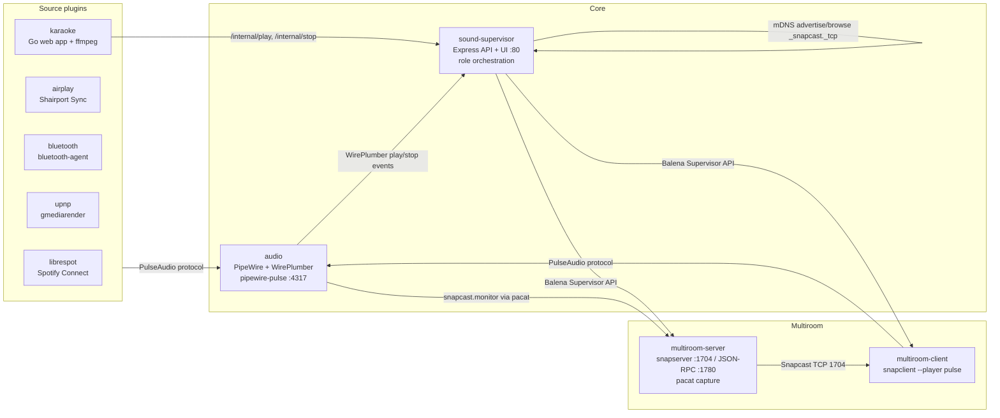

# System Map

AI-efficient map of the running containers and their responsibilities.

## Container topology

## Services

| Service | Path | Network | Restart | Owns | Notes |
|---|---|---:|---|---|---|
| `audio` | `core/audio/` | bridge, publishes `4317` | `unless-stopped` | PipeWire/WirePlumber, `pipewire-pulse`, virtual sinks, hardware source/sink selection | Privileged. Exposes PulseAudio-compatible TCP server. |
| `sound-supervisor` | `core/sound-supervisor/` | host | `unless-stopped` | Web UI/API, role orchestration, service start/stop, mDNS state, volume propagation | Uses balena API/supervisor API labels and shared D-Bus volume. |
| `multiroom-server` | `core/multiroom/server/` | host | `on-failure` | `snapserver`, FIFO, `pacat` capture from `snapcast.monitor` | Pre-warmed in `auto`, waits for `/multiroom/active`. |
| `multiroom-client` | `core/multiroom/client/` | host | `on-failure` | `snapclient --player pulse`, master-watchdog reconnect | Waits for `/multiroom/client-ready`; outputs to `balena-sound.output`. |
| `wifi-watchdog` | `core/watchdog/` | host | `unless-stopped` | WiFi recovery and optional reboot | Runs independently of audio routing. |
| `hostname` | `core/hostname/` | default | `unless-stopped` | Device hostname setup through supervisor API | Not in audio path. |
| `librespot` | `plugins/librespot/` | host | `on-failure` | Spotify Connect source | Waits for PulseAudio, network, and Avahi sentinel. |
| `airplay` | `plugins/airplay/` | host | `on-failure` | AirPlay source | Uses Shairport Sync with PulseAudio output. |
| `bluetooth` | `plugins/bluetooth/` | host | `on-failure` | Bluetooth source | Delegates to `bluetooth-agent`. |
| `upnp` | `plugins/upnp/` | default | not in compose currently | UPnP source | Present in repo but not listed in current `docker-compose.yml`. |
| `karaoke-fetcher` | `plugins/karaoke/fetcher/` | default | `on-failure` | Media search/download worker | Shares `karaoke-media` volume. |
| `karaoke` | `plugins/karaoke/app/` | bridge, publishes `8080` | `on-failure` | Karaoke UI/API, queue DB, local ffmpeg player, mic loopback | Talks to supervisor at `http://172.17.0.1:80` and PulseAudio at `tcp:172.17.0.1:4317`. |

## Important ports and sockets

| Endpoint | Owner | Consumers |
|---|---|---|
| TCP `4317` | `audio` / `pipewire-pulse` | Plugins, `multiroom-server` (`pacat`), `multiroom-client` (`snapclient`), supervisor `pactl` commands |
| HTTP `80` | `sound-supervisor` | Web UI, multiroom containers, karaoke app, humans |
| TCP `1704` | `multiroom-server` / `snapserver` | `multiroom-client` on local or remote devices |
| HTTP `1780` | `multiroom-server` / Snapcast JSON-RPC | `sound-supervisor` status and volume propagation |
| UDP `5353` | Avahi/mDNS stack | Spotify Connect advertisement and Snapcast discovery |
| HTTP `8080` | `karaoke` | Singer/audience/admin browsers |

## Shared volumes

| Volume | Used by | Purpose |
|---|---|---|
| `iotsound-dbus` | `sound-supervisor`, `airplay`, `librespot` | Shared Avahi/D-Bus readiness and socket data. |
| `librespot-config` | `librespot` | Spotify config and credentials. |
| `spotifycache` | declared | Spotify cache; currently not mounted in compose. |
| `karaoke-media` | `karaoke`, `karaoke-fetcher` | Downloaded media files. |
| `karaoke-data` | `karaoke` | SQLite app data and settings. |

## Control plane vs audio plane

| Plane | Primary owners | What flows through it |
|---|---|---|
| Audio plane | `audio`, `multiroom-server`, `multiroom-client`, plugins | PCM audio, Snapcast packets, hardware output |
| Control plane | `sound-supervisor`, Balena Supervisor API, Avahi/mDNS | Role changes, service lifecycle, discovery, volume, play/stop events |
| Karaoke app plane | `karaoke`, `karaoke-fetcher` | Queue/search APIs, browser media stream, optional local audio injection |

Keep those planes separate when debugging. A source can be healthy while routing is broken, and routing can be healthy while discovery or service lifecycle is broken.
